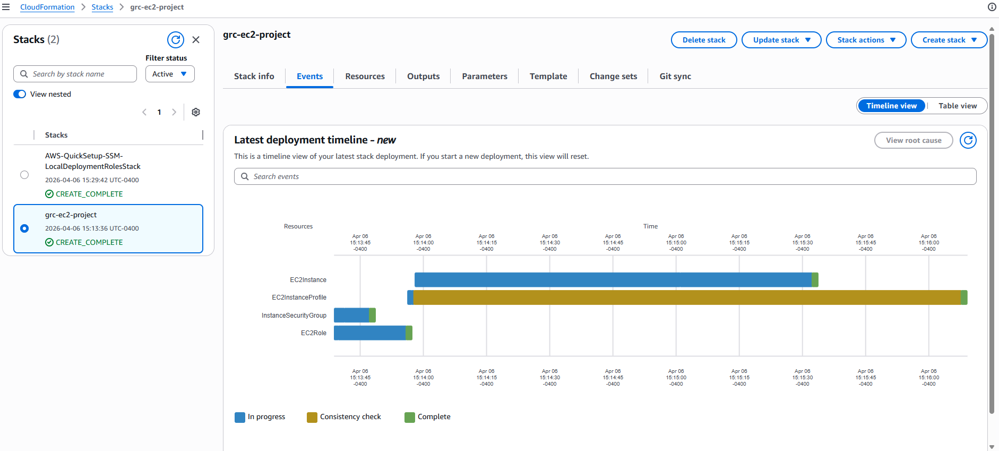
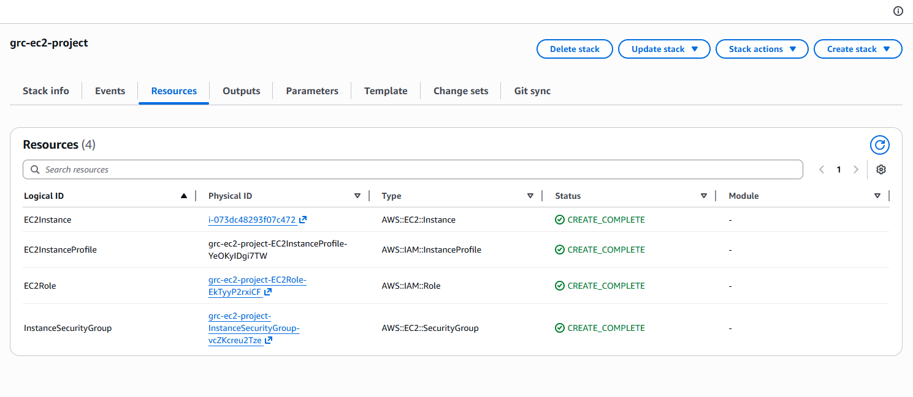
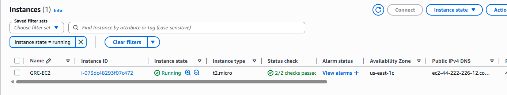
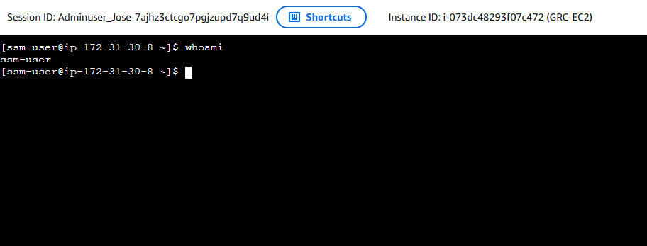
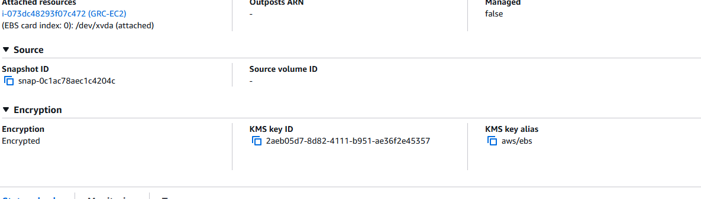
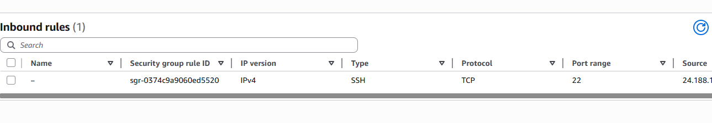
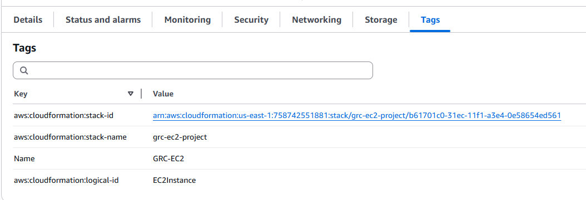

AWS GRC CloudFormation Project

Overview

This project demonstrates Infrastructure as Code (IaC) using AWS CloudFormation to deploy a secure EC2 instance aligned with Governance, Risk, and Compliance (GRC) principles.

---

Architecture
- EC2 (t2.micro - Free Tier)
- IAM Role (SSM access)
- Security Group
- Encrypted EBS Volume

---

GRC Controls Implemented
- Encryption at rest (EBS)
- IAM role (no hardcoded credentials)
- Least privilege network access
- Resource tagging for governance
- Secure access via Systems Manager (no SSH required)

---

Compliance Alignment

This project aligns with industry-standard security and compliance frameworks:

### CIS AWS Foundations Benchmark
- 1.4 - Ensure no root account access keys exist (IAM role used)
- 2.2 - Ensure CloudTrail is enabled (recommended future step)
- 4.1 - Ensure EBS encryption is enabled

### NIST SP 800-53 (Basic Mapping)
- AC-2: Account Management - IAM Role usage
- SC-12: Cryptographic Key Establishment - EBS encryption
- CM-6: Configuration Settings - Infrastructure as Code (CloudFormation)

### GRC Principles Applied
- Least Privilege Access
- Secure Configuration Management
- Data Protection at Rest
- Audit Readiness via IaC

---

Screenshots

### 1. CloudFormation Stack

### 2. Resources Created

### 3. EC2 Instance Running

### 4. Secure Access via SSM

### 5. Encrypted EBS Volume (Data Protection Control)

### 6. IAM Role

### 7. Security Group (Restricted Access)

### 8. Resource Tagging

---

Deployment Steps
1. Upload template.yaml to AWS CloudFormation
2. Provide EC2 Key Pair
3. Launch stack
4. Validate security controls

---

Key Takeaways
This project demonstrates how security and compliance can be embedded directly into infrastructure using Infrastructure as Code (IaC).

---

Jose Rodriguez
